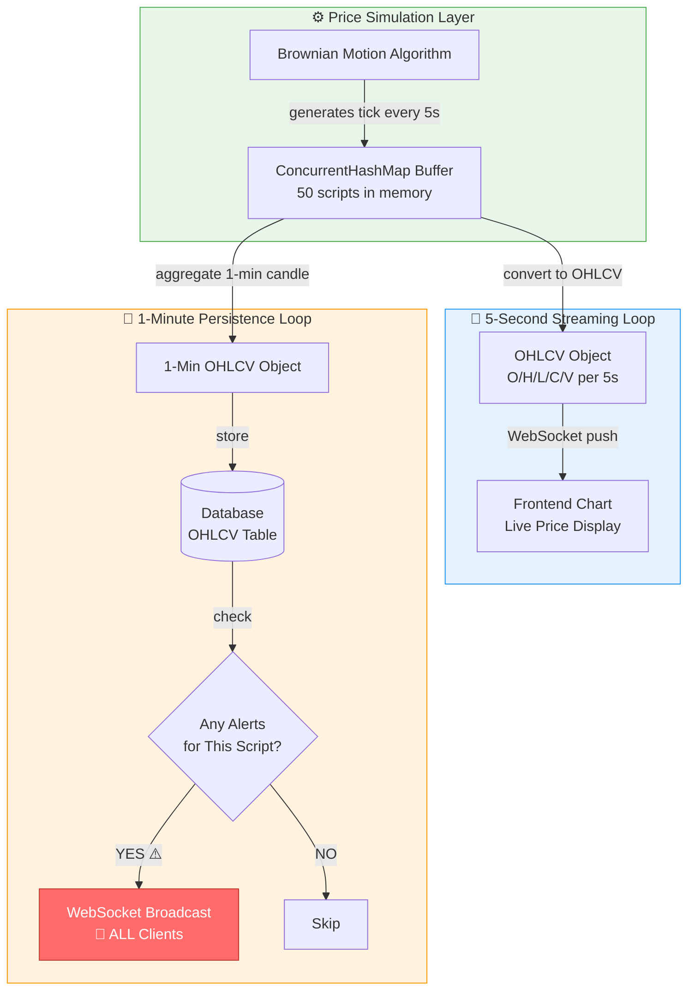
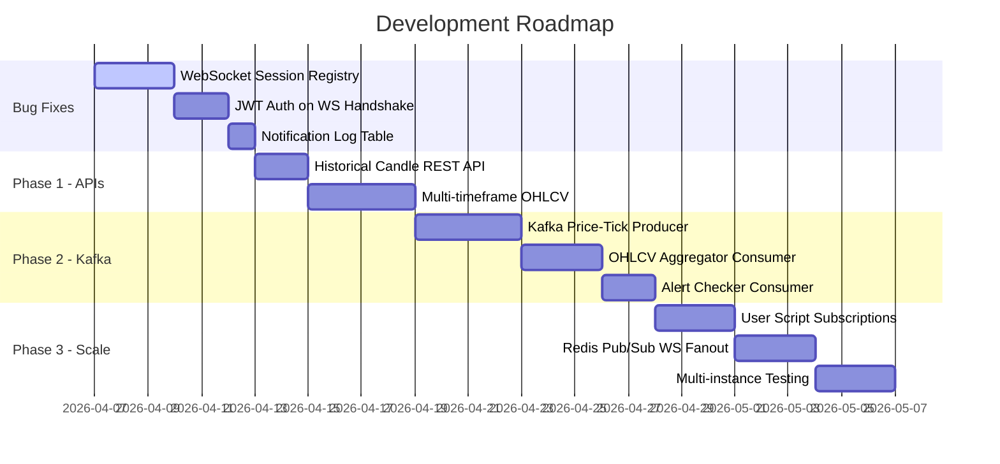
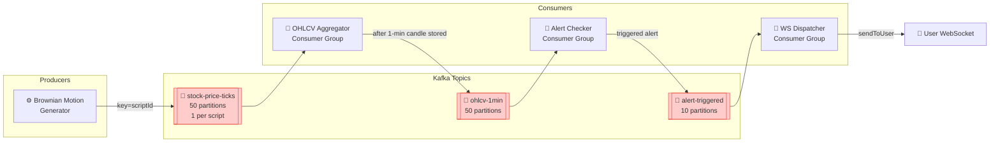
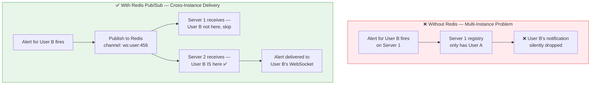
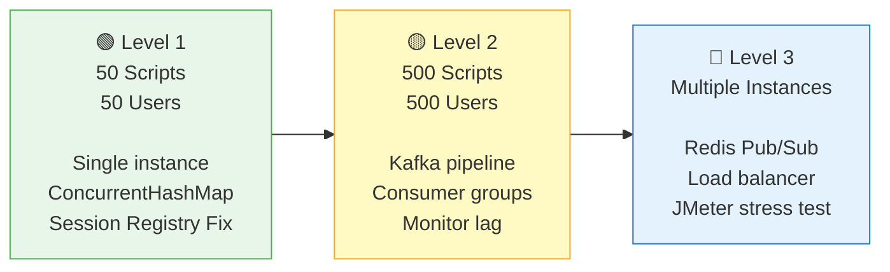

<div align="center">

# 📈 Real-Time Stock Simulation Engine

**A Spring Boot application simulating real-time stock price fluctuations for 50 scripts using Brownian Motion, with WebSocket-based live streaming, OHLCV aggregation, and a user alert system.**

<br/>


<br/>

[]()
[]()
[]()
[]()

</div>

---

## 📌 Table of Contents

- [Project Overview](#-project-overview)
- [Current Architecture](#-current-architecture)
- [How It Works](#-how-it-works)
- [Tech Stack](#-tech-stack)
- [Known Issues](#-known-issues--active-fixes)
- [Roadmap](#-roadmap)
- [Kafka Integration Plan](#-kafka-integration-plan)
- [Multi-User Scaling](#-multi-user-scaling-strategy)
- [Feature Backlog](#-feature-backlog)
- [Scale Milestones](#-scale-milestones)

---

## 🧭 Project Overview

This project simulates a **real-time stock market data engine** — similar to what powers live trading terminals. It is built as a learning system to explore:

- Real-time data pipelines with **WebSocket**
- In-memory buffering with **ConcurrentHashMap**
- Time-series aggregation into **OHLCV** (Open/High/Low/Close/Volume) candles
- **Price simulation** using Geometric Brownian Motion
- **User alert system** triggered on price conditions
- *(Planned)* Event-driven architecture with **Apache Kafka**
- *(Planned)* Horizontal scaling with **Redis Pub/Sub**

---

## 🏗️ Current Architecture

### System Flow Diagram



> **🔴 Bug:** The alert broadcast in the persistence loop sends to **all connected clients**, not just the user who set the alert. This is the #1 priority fix.

---

## ⚙️ How It Works

### Price Generation (Every 5 Seconds)

| Step | Component | Details |
|------|-----------|---------|
| 1 | **Brownian Motion Generator** | Simulates realistic price movement for 50 scripts using `dS = S(μdt + σdW)` |
| 2 | **ConcurrentHashMap Buffer** | Thread-safe in-memory store holds all price ticks for the current window |
| 3 | **OHLCV Conversion** | Aggregates ticks into Open/High/Low/Close/Volume for the 5s window |
| 4 | **WebSocket Push** | Sends OHLCV data to frontend — powers live candlestick chart for ITC, RELIANCE, etc. |

### Persistence & Alerts (Every 1 Minute)

| Step | Component | Details |
|------|-----------|---------|
| 1 | **1-Min Aggregation** | All 5s ticks in the last 60s are rolled into a single 1-min OHLCV candle |
| 2 | **DB Persist** | Candle stored to database for historical queries and backtesting |
| 3 | **Alert Check** | Query DB for user-configured price alerts on that script |
| 4 | **Notify** | ⚠️ *Currently broadcasts to all clients — needs fix (see below)* |

---

## 🛠️ Tech Stack

| Layer | Technology | Purpose |
|-------|-----------|---------|
| Backend | Spring Boot 3.x | Application framework |
| Real-time | WebSocket (STOMP) | Live price & alert delivery |
| In-Memory | ConcurrentHashMap | Thread-safe tick buffer |
| Simulation | Brownian Motion | Realistic price fluctuation |
| Database | PostgreSQL / MySQL | OHLCV candle persistence |
| *(Planned)* | Apache Kafka | Decoupled event pipeline |
| *(Planned)* | Redis Pub/Sub | Multi-instance WS fanout |

---

## 🔴 Known Issues / Active Fixes

### Bug: Alert Broadcasting to All Clients

**Problem:** When an alert condition triggers for User A, the WebSocket notification is sent to every connected user — not just User A.

**Root Cause:** No session registry exists. The service iterates all WebSocket sessions instead of looking up the session by `userId`.

**Fix (In Progress):**

```java
@Component
public class WebSocketSessionRegistry {

    // userId → WebSocket session mapping
    private final Map<Long, WebSocketSession> sessions =
        new ConcurrentHashMap<>();

    public void register(Long userId, WebSocketSession session) {
        sessions.put(userId, session);
    }

    public void remove(Long userId) {
        sessions.remove(userId);
    }

    // ✅ Send to ONE specific user only
    public void sendToUser(Long userId, String json) {
        WebSocketSession session = sessions.get(userId);
        if (session != null && session.isOpen()) {
            session.sendMessage(new TextMessage(json));
        }
    }
}
```

> Pass `userId` as a JWT claim during the WebSocket handshake. Extract it in `afterConnectionEstablished()` via `session.getAttributes()`. For multi-tab support, use `Map<Long, List<WebSocketSession>>`.

---

## 🗺️ Roadmap



---

## 🔧 Kafka Integration Plan

> **Why Kafka?** Currently, price generation, OHLCV conversion, DB write, and alert checking are all tightly coupled inside one `@Scheduled` thread. A slow alert query can delay the next price tick. Kafka decouples every step into independent consumers.

### Proposed Kafka Topic Architecture



### Topic Design Rationale

| Topic | Partitions | Key Strategy | Why |
|-------|-----------|-------------|-----|
| `stock-price-ticks` | 50 | `scriptId` | Guarantees tick ordering per script, 50-way parallelism |
| `ohlcv-1min` | 50 | `scriptId` | Each script's candles processed independently |
| `alert-triggered` | 10 | `userId` | All alerts for one user go to same partition |

### Sample Producer/Consumer Code

<details>
<summary>📄 View Kafka Producer — Price Tick Publisher</summary>

```java
@Service
public class PriceTickProducer {

    @Autowired
    private KafkaTemplate<String, PriceTick> kafkaTemplate;

    public void publish(PriceTick tick) {
        // key = scriptId ensures ordering per script
        kafkaTemplate.send("stock-price-ticks",
            tick.getScriptId().toString(), tick);
    }
}
```

</details>

<details>
<summary>📄 View Kafka Consumer — OHLCV Aggregator</summary>

```java
// Replaces your @Scheduled aggregation logic
@KafkaListener(
    topics = "stock-price-ticks",
    groupId = "ohlcv-aggregator"
)
public void onTick(PriceTick tick) {
    buffer.accumulate(tick);
    // flush to DB + publish to ohlcv-1min every 60s
}

// Triggered by new 1-min candle — replaces @Scheduled alert check
@KafkaListener(
    topics = "ohlcv-1min",
    groupId = "alert-checker"
)
public void onCandle(OhlcvCandle candle) {
    alertService.checkAndNotify(candle);
}
```

</details>

---

## 🌐 Multi-User Scaling Strategy

### The WebSocket Fan-out Problem

When scaling to multiple server instances, User A's WebSocket lives on Server 1 and User B's on Server 2. Server 1 cannot deliver a notification to a session it does not hold.



> **Note:** On localhost with a single instance, this is not needed. The session registry fix alone is sufficient. Add Redis only when you run 2+ server instances.

---

## ✨ Feature Backlog

| Priority | Feature | Description | Status |
|----------|---------|-------------|--------|
| 🔴 **P0** | WebSocket Session Registry | Fix alert routing — send only to alert owner | 🔧 In Progress |
| 🔴 **P0** | Notification Log Table | Persist every triggered alert to DB | 📋 Planned |
| 🟡 **P1** | Historical Candle REST API | `GET /api/candles?symbol=ITC&interval=1m` | 📋 Planned |
| 🟡 **P1** | Multi-Timeframe OHLCV | Aggregate 1m → 5m → 15m → 1h candles | 📋 Planned |
| 🟢 **P2** | Kafka Price-Tick Pipeline | Replace `@Scheduled` with Kafka producer/consumer | 📋 Planned |
| 🟢 **P2** | Rich Alert Conditions | % change, volume spike, RSI crossing 70/30 | 📋 Planned |
| 🔵 **P3** | User Script Subscriptions | Stream only watchlisted scripts per user | 📋 Planned |
| 🔵 **P3** | Virtual Portfolio P&L | Real-time P&L across user holdings | 📋 Planned |
| ⚪ **P4** | Redis Pub/Sub WS Fanout | Multi-instance alert delivery | 📋 Planned |

---

## 📊 Scale Milestones



| Level | Scripts | Users | Architecture | Status |
|-------|---------|-------|-------------|--------|
| **L1** | 50 | 50 | Single instance, ConcurrentHashMap, Session Registry | 🔧 Active |
| **L2** | 500 | 500 | + Apache Kafka, Consumer Groups | 📋 Planned |
| **L3** | 1000+ | 1000+ | + Redis Pub/Sub, Load Balancer, Multi-instance | 🔮 Future |

---

## 📁 Project Structure

```
stock-simulation/
├── src/main/java/
│   ├── simulation/
│   │   ├── BrownianMotionGenerator.java    # Price simulation engine
│   │   └── PriceScheduler.java             # @Scheduled 5s tick loop
│   ├── buffer/
│   │   └── PriceTickBuffer.java            # ConcurrentHashMap store
│   ├── aggregation/
│   │   ├── OhlcvAggregator.java            # 5s + 1min OHLCV builder
│   │   └── OhlcvPersistenceJob.java        # 1-min DB write scheduler
│   ├── alert/
│   │   ├── AlertChecker.java               # DB alert query + notify
│   │   └── AlertService.java               # Alert CRUD
│   ├── websocket/
│   │   ├── StockWebSocketHandler.java      # WS connection handler
│   │   └── WebSocketSessionRegistry.java   # ⬅️ TODO: Implement this
│   └── model/
│       ├── PriceTick.java
│       ├── OhlcvCandle.java
│       └── Alert.java
└── src/main/resources/
    └── application.yml
```

---

## 🚀 Getting Started

```bash
# Clone the repository
git clone https://github.com/your-username/stock-simulation.git
cd stock-simulation

# Run the application
./mvnw spring-boot:run

# WebSocket endpoint
ws://localhost:8080/ws/stock-prices

# Connect with client
# Pass userId as query param: ws://localhost:8080/ws/stock-prices?userId=123
```

---

<div align="center">

**Built with ☕ Java + Spring Boot | Learning system for real-time data engineering**

[](https://github.com/your-username/stock-simulation)

</div>
